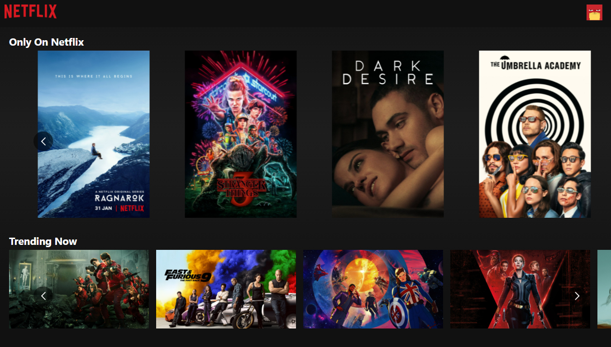
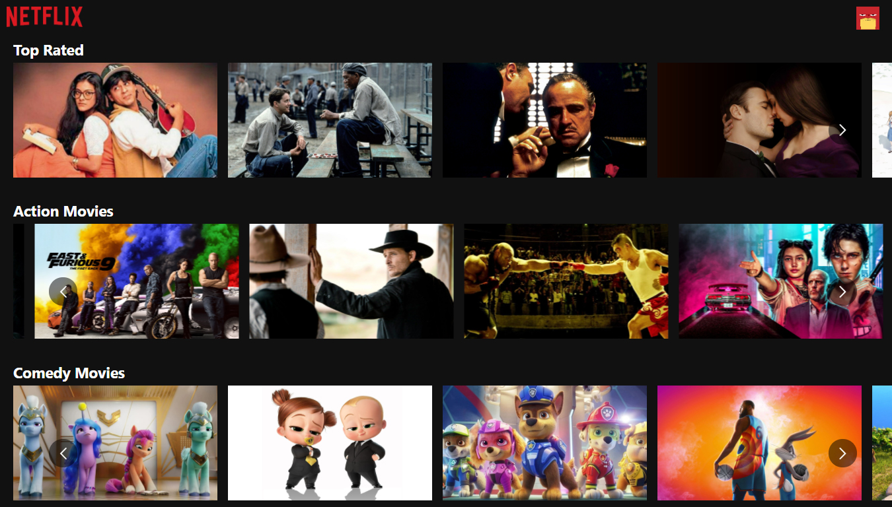
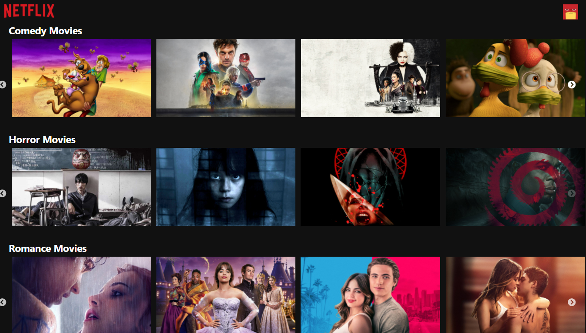
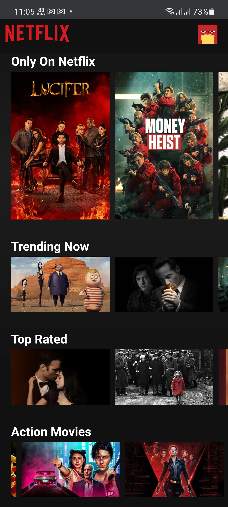
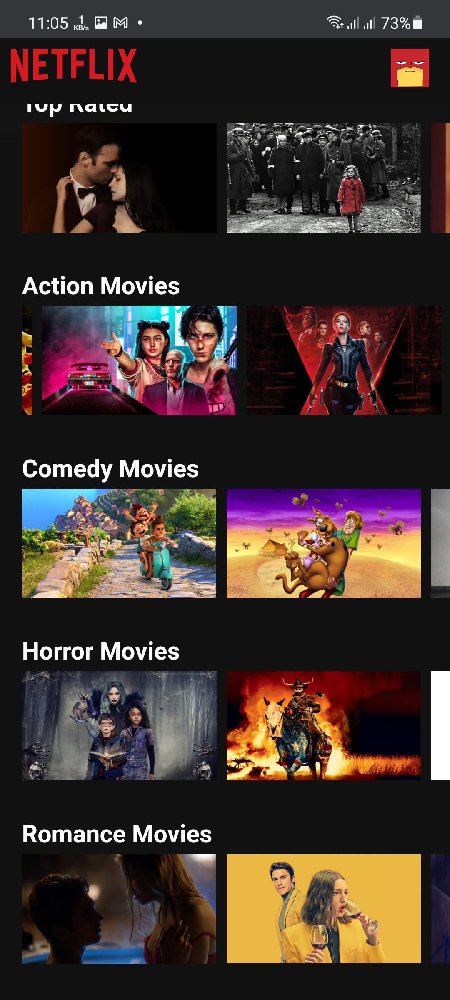

<h2 align="center">Hey Developers! Presenting you all the 'Netflix Clone'. </h2>
<h2 align="center">





<h3 align="center">Desktop view 💻</h3>
<hr/>

<div style="display:flex">
    
    
</div>

<h3 align="center">Mobile view 📱</h3>
<hr/>
# Getting Started with Create React App


## Built With
This project is build with following languages and framework


 
- 
- 
- 
  


## 📌Contributing Guidelines :

**1.**  Firstly,create an issue then,

**2.**  Fork [this](https://github.com/Janiru/netflix-clone) repository.

**3.**  Clone your forked copy of the project.
```sh
git clone https://github.com/<your_name>/netflix-clone.git
```
**4.** Navigate to the project directory :file_folder: .
```sh
cd netflix-clone
```
**5.** Add a reference(remote) to the original repository.
```sh
git remote add upstream https://github.com/Janiru/netflix-clone.git
```
**6.** Check the remotes for this repository.
```sh
git remote -v
```
**7.** Always take a pull from the upstream repository to your master branch to keep it at par with the main project(updated repository).
```sh
git pull upstream master
```
**8.** Create a new branch.
```sh
git checkout -b <your_branch_name>
```
**9.** Perfom your desired changes to the code base.


**10.** Track your changes:heavy_check_mark: 
```
git add . 
```
**11.** Commit your changes .
```
git commit -m "Relevant message"
```
**12.** Push the committed changes in your feature branch to your remote repo.
```
git push -u origin <your_branch_name>
```
**12.** To create a pull request, click on `compare and pull requests`. Please ensure you compare your feature branch to the desired branch of the repo you are suppose to make a PR to.

**13.** Add appropriate title and description to your pull request explaining your changes and efforts done. Always make sure you have pulled the latest code from the master branch before making a PR.

**14.** Click on `Create Pull Request`.


*Happy Hacktoberfest!*
